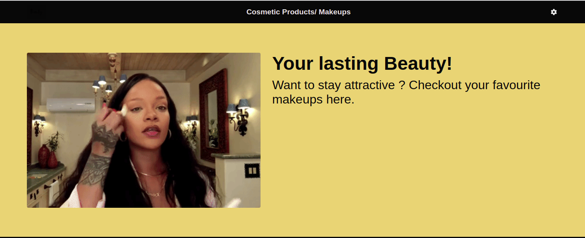
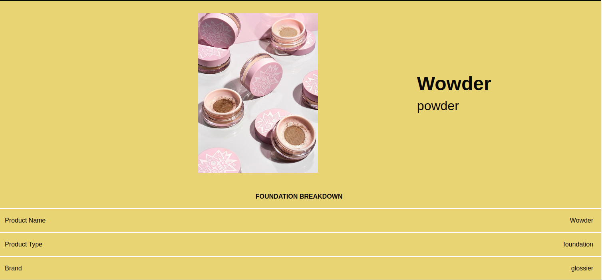

# Air-pollution
This is an SPA that consists of air pollution data


# Air-pollution
Users can see data of air pollution by clicking on different links


> Open with with the server


.

## Built With

- React & Redux
- Visual Studio Code.
- Linters
- Gitflow

## Live Demo

[github page](https://github.com/moise-mulungu/Air-pollution)

## Deploy 

- [Netlify](https://animated-stroopwafel-ca252e.netlify.app/)

## Getting Started

To get a local copy of this app you can use :
```
git clone  https://github.com/moise-mulungu/Air-pollution
```
# Install

- Run :
1. `npm create-react-redux.`
2. `cd <app's name>`,
3. `npm start`

# Usage

Run `npm start` to open the live server

## Author

👤 **Moise Mulungu**

- GitHub: [Moise Mulungu](https://github.com/moise-mulungu)
- Twitter: [Moise Mulungu](https://twitter.com/moise_mulungu)
- LinkedIn: [Moise Mulungu](https://www.linkedin.com/in/moisemulungu/)

## 🤝 Contributing

Contributions, issues, and feature requests are welcome!

Feel free to check the [issues page](https://github.com/moise-mulungu/Air-pollution/issues).

## Design Author

- Nelson Sakwa on Behance, a User Interface Designer: [Nelson Sakwa](http://sakwadesign.com/)
- The Creative Common License of the Design: (https://creativecommons.org/licenses/by-nc/4.0/)

## Show your support

Give a ⭐️ if you like this project!

## 📝 License

This project is [MIT](./MIT.md) licensed.
 